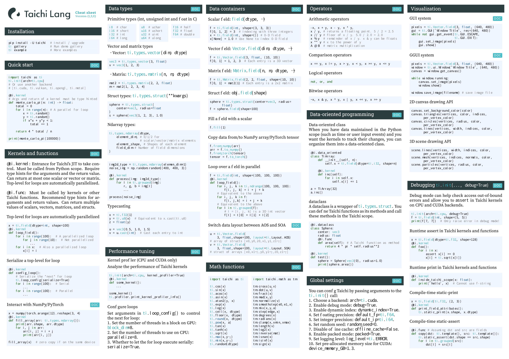

# Taichi Languge Cheatsheet

## How to build

1. Go to the `fonts/` folder, run
    ```
    make
    ```
    
    to download the font files.

2. Use `xelatex` to compile the source tex:

    ```bash
    xelatex cheatsheet.tex
    ```

